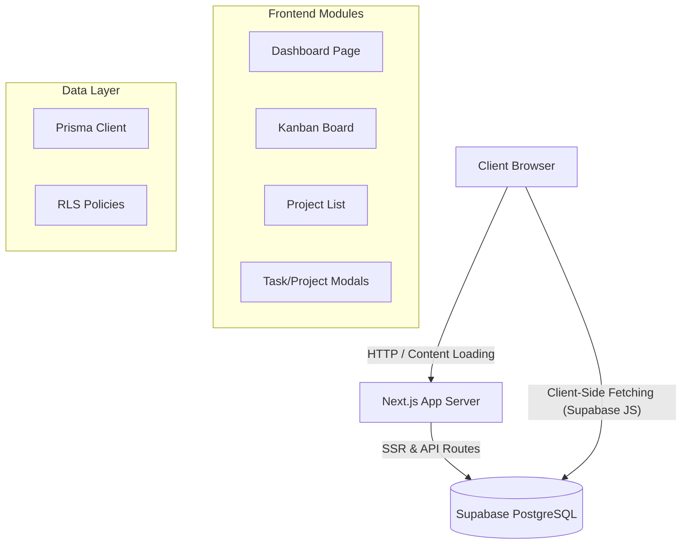

# Ops-System: Technical Project Report

**Date:** January 8, 2026
**Prepared By:** AI Technical Consultant
**Project Status:** Active / In Development

---

## 1. Executive Summary

The **Ops-System** is a modern, web-based project management and operational command center designed to streamline team collaboration, task tracking, and status visibility. Built on a cutting-edge stack featuring **Next.js 16**, **TypeScript**, and **Supabase**, the application provides a responsive and intuitive interface for managing projects and tasks.

This report documents the current state of the application, including its technical architecture, feature set, database implementation, and recommendations for future scalability. the application has recently undergone significant enhancements to improve dashboard accuracy and task management capabilities.

## 2. Project Overview

### 2.1 Objectives
The primary objective of the Ops-System is to replace fragmented project tracking tools with a unified platform that offers:
*   **Real-time visibility** into project health and task status.
*   **Intuitive workflow management** via interactive Kanban boards.
*   **Data-driven insights** through visual dashboards and metrics.
*   **Seamless collaboration** with assignee management and clear deadlines.

### 2.2 Scope
The current implementation covers the following core modules:
*   **Dashboard**: Central hub for high-level metrics and activity trends.
*   **Task Management**: Comprehensive Kanban board for task lifecycle management.
*   **Project Management**: Project creation and status tracking.
*   **Status Updates**: Logging and visualizing project updates and blockers.

## 3. Technical Architecture

### 3.1 Technology Stack
The application leverages a robust, modern web stack designed for performance and developer experience.

| Component | Technology | Description |
| :--- | :--- | :--- |
| **Framework** | **Next.js 16** (App Router) | React framework for server-side rendering and static generation. |
| **Language** | **TypeScript** | Strongly typed JavaScript for improved maintainability. |
| **Styling** | **Tailwind CSS** | Utility-first CSS framework for rapid UI development. |
| **UI Library** | **Shadcn UI** | Accessible, re-usable component built on Radix UI. |
| **Database** | **PostgreSQL** (via Supabase) | Relational database management. |
| **ORM** | **Prisma** | Type-safe database client. |
| **State/Data** | **Supabase Client** | Real-time data fetching and subscriptions. |
| **Visualization** | **Recharts** | Composable charting library. |
| **Icons** | **Lucide React** | Consistent and lightweight icon set. |

### 3.2 Application Architecture
The application follows a modular architecture using Next.js App Router.

## 4. Functional Analysis

### 4.1 Dashboard
The dashboard serves as the landing page, providing critical insights at a glance.
*   **KPI Cards**: "Active Projects", "Total Tasks", "Completion Rate", and "Blockers".
*   **Visualizations**:
    *   **Project Status**: Pie chart distribution of project states.
    *   **Task Priority**: Bar chart showing workload intensity.
    *   **Activity Trend**: Line chart of tasks created over the last 7 days.
*   **Implementation Note**: Recent fixes ensure "Planning" projects are correctly counted as active, providing a more accurate view of the pipeline.

### 4.2 Task Management
The task module is the operational core, featuring a fully interactive Kanban board.
*   **Kanban Board**: Drag-and-drop interface powered by `@hello-pangea/dnd`. Columns: *To Do*, *In Progress*, *Review*, *Done*.
*   **Task Metadata**: Tasks now support **Assignees** (User mapping) and **Due Dates**, visually represented on the Kanban cards with avatars and status indicators.
*   **Creation Flow**: A modal interface allows rapid task entry with fields for project association, priority, description, assignee, and deadline.

### 4.3 Database Schema
The data model is normalized and managed via Prisma Schema (`schema.prisma`).

**Core Models:**
*   **User**: System users with role-based access fields (`ADMIN`, `MEMBER`).
*   **Project**: High-level container for tasks, updates, and decisions. Statuses include `PLANNING`, `ACTIVE`, `ON_HOLD`, `COMPLETED`.
*   **Task**: Unit of work linked to a Project and optional User (Assignee). Includes priority levels (`LOW` to `URGENT`) and status workflow.
*   **Update**: Time-series entries for project status reporting (Sentiment: `ON_TRACK`, `AT_RISK`, `BLOCKED`).

## 5. Implementation Details

### 5.1 Key Challenges & Solutions
*   **Interactive Drag-and-Drop**: Implementing a smooth Kanban experience involved integrating `@hello-pangea/dnd`. To ensure data consistency, the application uses **optimistic UI updates**—updating the visual state immediately while performing the database write in the background.
*   **Data Accuracy**: A discrepancy in the "Active Projects" count was identified where projects in the planning phase were ignored. This was rectified by updating the logic to include both `ACTIVE` and `PLANNING` statuses in the count.

## 6. Recommendations & Roadmap

### 6.1 Immediate Improvements
1.  **Authentication Integration**: While a User table exists, integration with a full auth provider (like Supabase Auth) should be formalized to secure RLS policies.
2.  **Server-Side Fetching**: Move more data fetching from client-side `useEffect` hooks to React Server Components (RSC) to improve initial load performance and SEO.
3.  **Mobile Responsiveness**: Enhance the Kanban board for better touch interaction on mobile devices.

### 6.2 Future Capabilities
*   **Notifications**: Implement real-time alerts for task assignments and deadline approaches.
*   **Audit Logging**: Track history of task movements and edits for compliance and review.
*   **Advanced Analytics**: Expand the dashboard to show "Time to Complete" metrics and user velocity.

---
*End of Report*
